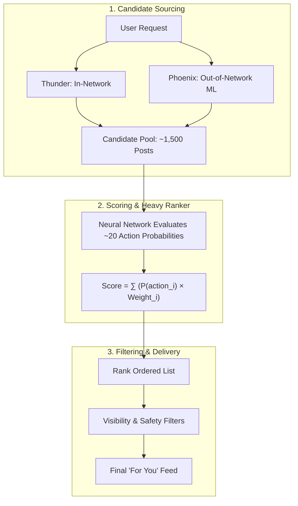

# X Algorithm: Scoring Weights & Pipeline Mechanics

> **Source:** Video Breakdown & Algorithmic Summary  
> **Topic:** For You Feed Scoring, Action Weights, Penalty Ratios, and Dual-Engine Retrieval (Thunder & Phoenix)  
> **Date Added:** 2026-08-14

---

## 📊 Summary: Engagement Weights vs. Penalties

### 1. Positive Signal Multipliers
Positive actions indicate resonance and external reach. Copy Link is by far the highest-leverage positive action.

| User Action | Raw Points | Relative Multiplier (vs. Like) | Why It Matters |
|---|---|---|---|
| **Like** | **0.5 pts** | **1.0x** (Baseline) | Low-friction casual engagement |
| **Retweet / Repost** | **1.0 pt** | **2.0x** | Endorsement to follower network |
| **Reply** | **5.0 pts** | **10.0x** | High-effort conversational engagement |
| **Quote Tweet** | **5.0 pts** | **10.0x** | Contextual commentary & distribution |
| **Share via DM** | **5.0 pts** | **10.0x** | High-intent private social circulation |
| **Share by Copy Link** | **20.0 pts** | **40.0x** | **Highest Signal** — Indicates off-platform sharing & bringing new users to X |

---

### 2. Negative Feedback Penalties
Negative actions heavily downrank posts and authors. The penalty scale is calibrated in equivalent lost likes.

| Negative Action | Cost in Likes | Estimated Negative Points | Impact Level |
|---|---|---|---|
| **Report Post / Account** | **-468 Likes** | ~ -234.0 pts | 🚨 **Severe** — Highest penalty; triggers trust/safety review |
| **Mute Author** | **-118 Likes** | ~ -59.0 pts | ⚠️ **High** — Explicit suppression of author's future content |
| **Mark "Not Interested"** | **-86 Likes** | ~ -43.0 pts | 📉 **Medium-High** — Topic / author relevancy downweighting |
| **Block Author** | **-62 Likes** | ~ -31.0 pts | ⛔ **Medium** — Complete severance of graph edge |

---

## ⚙️ How the Algorithm Evaluates Posts

### 1. Dual Candidate Retrieval
Every timeline pull aggregates posts from two distinct pipelines:
- **`Thunder`**: In-network retrieval engine that fetches recent, relevant posts from accounts the user already follows.
- **`Phoenix`**: Machine-learning retrieval system that discovers out-of-network posts from accounts the user does *not* follow, matching interest clusters and embeddings (SimClusters).

### 2. Probabilistic Scoring Mechanism
Once candidates are pooled:
1. The neural Heavy Ranker model calculates the probability $P(\text{action}_i)$ for **~20 discrete actions** a user might take (e.g., $P(\text{like}) = 0.10$, $P(\text{reply}) = 0.02$, $P(\text{copy\_link}) = 0.01$, $P(\text{report}) = 0.0001$).
2. Each predicted probability is multiplied by its fixed weight $W_i$.
3. The sum yields the final composite ranking score:
   $$\text{Final Score} = \sum_{i=1}^{20} P(\text{action}_i) \cdot W_i$$
4. Posts with the highest expected value / composite score pass through diversity and safety filters to appear in the user's **For You** feed.

---

## 📝 Original Transcript

> *"Elon Musk just open-sourced the actual algorithm behind X's For You feed. And here is the exact lowdown.*
>
> *A like is worth 0.5 points. A retweet is worth 1 point. A reply, quote tweet, or sharing a post via DM is worth 5 points individually, 10x more than a like. While sharing a post by copy link is worth 20 points. A whopping 40 times stronger signal than a like because it indicates the post is being shared outside of X, bringing in new users.*
>
> *On the flip side, the negative weights are brutal. Getting reported just once costs you about 468 likes, getting muted costs 118 likes. Getting blocked costs 62 likes, and getting marked "not interested" costs 86 likes.*
>
> *But what's more important than these numbers or weights is exactly how X uses them in its algorithm. So every post on X gets pulled from two places: Thunder, which just grabs recent posts from people you already follow, and Phoenix, an ML retrieval system that finds posts from people you don't follow but you might be interested in.*
>
> *Now once all those posts are collected, they go through a scoring mechanism where each post is given a score based on 20 different actions you might do with them. For example, say a post has 10% chance you like it, 2% chance you reply, and 1% chance you share it via copy link. The algorithm multiplies each of those probabilities by a fixed number called a weight, associated with each action, and gives it one final probability. And that final probability is what decides if the post will make it to your feed or not.*
>
> *Anyways, it's pretty interesting to see such a big platform finally letting everyone know how their algorithm works... which, as Elon says, is crucial for humanity and understanding how people are..."*
