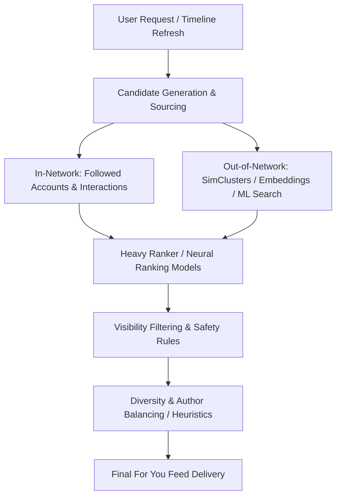

# X Algorithm Knowledge Base & Research Notes

> **Repository:** [blue8akash/x-algorithm](https://github.com/blue8akash/x-algorithm) (Forked from [xai-org/x-algorithm](https://github.com/xai-org/x-algorithm))  
> **Purpose:** Curated notes, architectural breakdowns, heuristic insights, and algorithmic reverse-engineering of the X / Twitter recommendation pipeline.

---

## 🧭 Architecture Overview Map

---

## 📂 Topic Notes Directory

Add your detailed markdown notes and analyses under this directory:

| Document / Area | Description | Status |
|---|---|---|
| [`01-Scoring-Weights-And-Mechanics.md`](./01-Scoring-Weights-And-Mechanics.md) | Engagement weights, negative penalties, and dual-engine retrieval (Thunder & Phoenix) | ✅ Active |
| [`02-Architecture-Overview.md`](./02-Architecture-Overview.md) | High-level system topology, request lifecycles, and service dependencies | ⬜ Planned |
| [`03-Candidate-Sourcing.md`](./03-Candidate-Sourcing.md) | In-network vs out-of-network candidate retrieval and pipeline mechanics | ⬜ Planned |
| [`04-Heavy-Ranker-Scoring.md`](./04-Heavy-Ranker-Scoring.md) | Transformer-based ranking, engagement probability scoring, and 20-action weights | ⬜ Planned |
| [`05-SimClusters-Embeddings.md`](./05-SimClusters-Embeddings.md) | Community detection, topic clustering, and interest spaces | ⬜ Planned |
| [`06-Visibility-Filtering.md`](./06-Visibility-Filtering.md) | Safety filters, abuse enforcement, bot detection, and drop rules | ⬜ Planned |
| [`07-User-Credibility-Reputation.md`](./07-User-Credibility-Reputation.md) | `user-cred-v2`, author reputation metrics, and reach modifiers | ⬜ Planned |
| [`08-Heuristics-Feed-Mixer.md`](./08-Heuristics-Feed-Mixer.md) | Home-mixer logic, diversity penalties, and UI interleaving | ⬜ Planned |

---

## 💡 Quick Reference: Key Codebase Subsystems

- `home-mixer/`: Orchestrates candidate generation, scoring, and post-filtering for the Home timeline.
- `candidate-pipeline/`: Framework for assembling and pulling tweet candidates across sources.
- `simclusters/`: Multi-modal community representation and clustering algorithms.
- `phoenix-rankall` / `vm-ranker`: Heavy neural ranking model inference services.
- `visibility-filtering/`: Safety checks, drop filters, and content classification.
- `user-cred-v2/`: User credibility scoring and graph-based trust signals.
- `under-the-hood/`: Label transparency tools and explainability endpoints.
